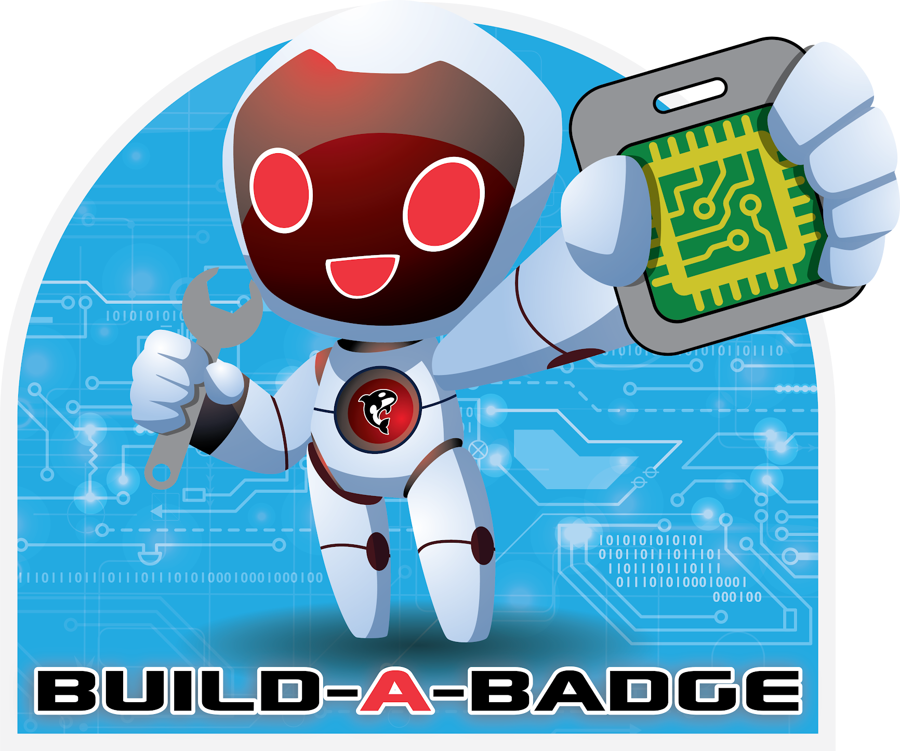

# Build-A-Badge



A interactive badge customization application built with Rust and Iced GUI framework. Create and configure custom badges with personalized images, LED patterns, and names for DEFCON and other events.

## Features

- 🎨 **Custom Image Selection** - Choose from 5 pre-loaded images or upload your own
- 💡 **LED Pattern Configuration** - 14 different LED light modes including Rainbow, Audio-reactive, and Accelerometer-based patterns
- 📝 **Badge Naming** - Personalize your badge with a custom name (up to 23 characters)
- 🔧 **Real-time Device Configuration** - Live console output during device programming
- 📱 **Cross-platform Support** - Available for Windows, macOS, and Linux
- 🚀 **WASM Application Support** - Upload and execute WebAssembly applications on your badge

## Screenshots

The application features a intuitive multi-step workflow:
1. **Welcome Screen** - Introduction and getting started
2. **Image Selection** - Choose your badge image from available options
3. **LED Configuration** - Select LED light patterns and effects
4. **Badge Naming** - Enter your personalized badge name
5. **Configuration Summary** - Review and deploy to device

## Installation

### Pre-built Binaries

Download the latest release for your platform from the [Releases](https://github.com/freewili/build_a_badge/releases) page:

- **Linux**: `build-a-badge-linux.tar.gz`
- **Windows**: `build-a-badge-windows.zip`
- **macOS**: `build-a-badge-macos.tar.gz`

Extract the archive and run the `build_a_badge` executable.

### Building from Source

#### Prerequisites

- [Rust](https://rustup.rs/) (latest stable version)
- System dependencies (automatically installed by the build process on most platforms)

#### Linux Dependencies

On Ubuntu/Debian:
```bash
sudo apt-get update
sudo apt-get install -y \
  libasound2-dev \
  libxkbcommon-dev \
  libwayland-dev \
  libxrandr-dev \
  libxcursor-dev \
  libxi-dev \
  libgl1-mesa-dev \
  libglu1-mesa-dev \
  pkg-config \
  libglib2.0-dev \
  libgtk-3-dev \
  libgdk-pixbuf2.0-dev \
  libpango1.0-dev \
  libatk1.0-dev \
  libcairo-gobject2 \
  libcairo2-dev \
  libjpeg-dev \
  libpng-dev
```

#### Build Commands

```bash
# Clone the repository
git clone https://github.com/freewili/build_a_badge.git
cd build_a_badge

# Build in release mode
cargo build --release

# Run the application
cargo run --release
```

## Usage

1. **Connect Your Badge** - Ensure your badge is connected via USB and recognized by the `fwi-serial` tool
2. **Launch the Application** - Run the Build-A-Badge executable
3. **Follow the Workflow**:
   - Select your desired image from the available options
   - Choose an LED pattern that matches your style
   - Enter a personalized name for your badge
   - Review your configuration in the summary screen
   - Click "Configure Device" to upload to your badge

### LED Modes

The application supports 14 different LED patterns:

- **Manual** - Manual control
- **Rainbow** - Cycling rainbow colors
- **Snowstorm** - Random white flashes
- **Red Chase** - Red light chasing pattern
- **Rainbow Chase** - Rainbow chasing effect
- **Blue Chase** - Blue light chasing pattern
- **Green Dot** - Single green dot pattern
- **Blue Dot** - Single blue dot pattern
- **Blue Sin** - Sinusoidal blue wave
- **White Fade** - Fading white effect
- **Bar Graph** - Bar graph visualization
- **Zylon** - Cylon-style sweep
- **Audio** - Audio-reactive patterns
- **Accelerometer** - Motion-reactive patterns

## Hardware Requirements

- Compatible badge device with `fwi-serial` support
- USB connection for device programming
- Windows 10+, macOS 10.14+, or modern Linux distribution

## Configuration Files

The application generates several configuration files during the badge programming process:

- `build_a_badge.txt` - Main configuration with badge name and LED mode
- `settings.txt` - WiFi and Bluetooth settings
- `build_a_badge.wasm` - WebAssembly application for the badge

## Development

### Project Structure

```
build_a_badge/
├── src/
│   └── main.rs          # Main application logic
├── assets/              # Image assets and resources
│   ├── logo.png         # Application logo
│   ├── *.png           # Selectable badge images
│   └── *.fwi           # Badge firmware image files
├── .github/
│   └── workflows/
│       └── build.yml   # CI/CD pipeline
└── Cargo.toml          # Rust dependencies
```

### Contributing

1. Fork the repository
2. Create a feature branch (`git checkout -b feature/amazing-feature`)
3. Commit your changes (`git commit -m 'Add amazing feature'`)
4. Push to the branch (`git push origin feature/amazing-feature`)
5. Open a Pull Request

### Built With

- [Rust](https://www.rust-lang.org/) - Systems programming language
- [Iced](https://iced.rs/) - Cross-platform GUI framework
- [Tokio](https://tokio.rs/) - Asynchronous runtime
- [Image](https://crates.io/crates/image) - Image processing

## License

This project is licensed under the MIT License - see the [LICENSE](#license) file for details.

---

## License

MIT License

Copyright (c) 2025 FreeWili

Permission is hereby granted, free of charge, to any person obtaining a copy
of this software and associated documentation files (the "Software"), to deal
in the Software without restriction, including without limitation the rights
to use, copy, modify, merge, publish, distribute, sublicense, and/or sell
copies of the Software, and to permit persons to whom the Software is
furnished to do so, subject to the following conditions:

The above copyright notice and this permission notice shall be included in all
copies or substantial portions of the Software.

THE SOFTWARE IS PROVIDED "AS IS", WITHOUT WARRANTY OF ANY KIND, EXPRESS OR
IMPLIED, INCLUDING BUT NOT LIMITED TO THE WARRANTIES OF MERCHANTABILITY,
FITNESS FOR A PARTICULAR PURPOSE AND NONINFRINGEMENT. IN NO EVENT SHALL THE
AUTHORS OR COPYRIGHT HOLDERS BE LIABLE FOR ANY CLAIM, DAMAGES OR OTHER
LIABILITY, WHETHER IN AN ACTION OF CONTRACT, TORT OR OTHERWISE, ARISING FROM,
OUT OF OR IN CONNECTION WITH THE SOFTWARE OR THE USE OR OTHER DEALINGS IN THE
SOFTWARE.

---

<div align="center">
  
  <br>
  <em>Build your badge, express yourself! 🚀</em>
</div>
